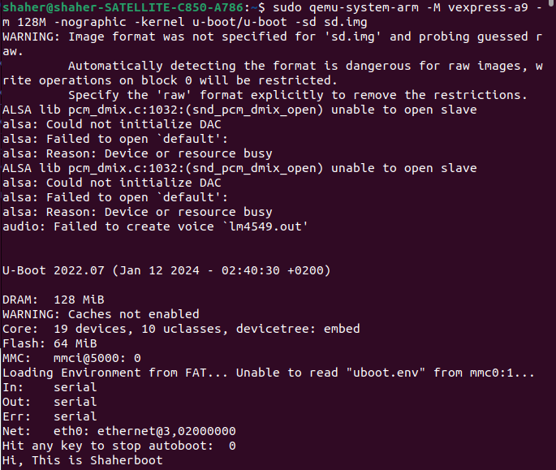
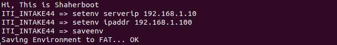
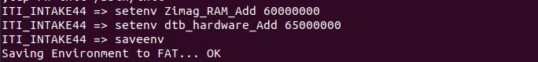
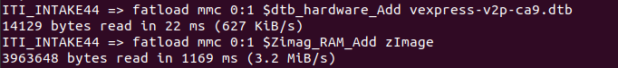
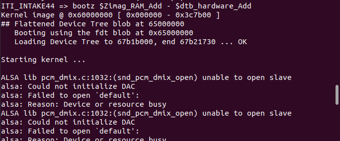
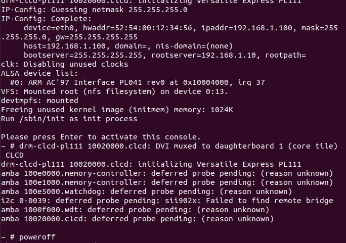
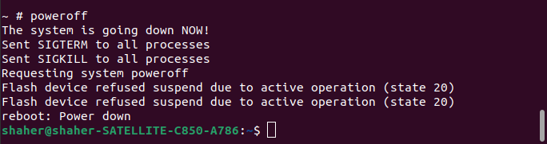

1. ### First, We install NFS package through

   ```
   sudo apt install nfs-kernel-server
   ```

2. ### Then We will put the root file system in a directory related to the NFS to be able later to mount the rootfs through the NFS server:

   - #### First We will create a directory under /srv for the NFS (nfs-share), to put our data (rootfs) in it and then be able to use it.

   - #### Then copy the files in rootfs_Dynamic into /srv/nfs-share

     ```
     sudo cp -rp ~/rootfs_Dynamic/* /srv/nfs-share
     ```

3. ### Now We will configure the NFS to know that there is a target with a certain IP address will access or use the server to get data from it. This configuration file is /etc/exports, where we will edit in it putting the path /srv/nfs-share and the IP address of the target:

   ##### First open the file to edit it:

   ```
   sudo vim /etc/exports
   ```

   ##### Put the following line in it:

   ```
   /srv/nfs-share 192.168.1.100(rw,no_root_squash,no_subtree_check)
   ```

   **rw**: to make the target able to read from and write to the nfs-share directory.

    **no_root_squash**: To treat the root of the target as a root when access the server.

   ##### Finally doing a refresh step to make sure that our edit in /etc/exports is heared

   ```
   sudo systemctl restart nfs-kernel-server
   ```

4. ### Now we will run qemu, configure it that we have an SD card attatched, and make the target have a network interface so that We are able to load the root file system through the server.

   ```
   sudo qemu-system-arm -M vexpress-a9 -m 128M -nographic -kernel u-boot/u-boot -sd sd.img -net tap,script=./qemu-ifup -net nic
   ```

   

   ##### Now We will set some environment variables such as the IP address of the server (my PC) (I know my address thorugh "ip addr" command before running qemu), and the IP address of the target (I assumed it 192.168.1.100 and I made sure that no one using this IP address):

    

   ##### Then edit **"bootargs"** variable giving it the console or the terminal the system will run at, and the place where the rootfs is at, and the init process path (which is a safe point the system will return to when an error occur):

   ```
   setenv bootargs 'console=ttyAMA0  root=/dev/nfs ip=192.168.1.100:::::eth0 nfsroot=192.168.1.10:/srv/nfs-share,nfsvers=3,tcp rw init=/sbin/init'
   ```

   ##### Then setting the addresses in the target's RAM where the zImage and the DTB file will be loaded at:

   

   ##### Now We will load the zImage and the DTB file from the SD card to the target's RAM:

   

   ##### Finally, Booting the kernel:

   

5. ### Congrats

   

6. ### Finally power off the system:

   

   