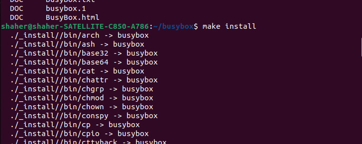
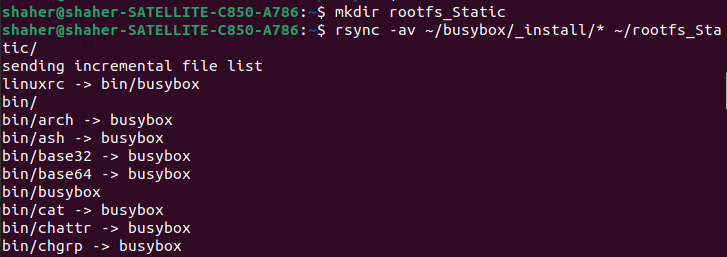
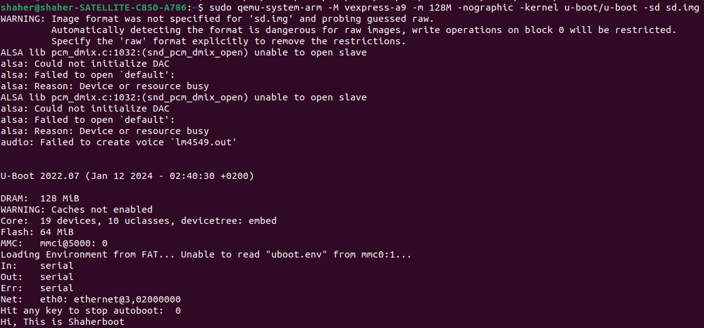

1. # Clone Linux Repo, and go inside linux directory

   

2. # Setting the cross compiler and the architecture we will run on it. Then do make configuration for our target. Then make menuconfig to edit 3 things which are: automount devtmpfs, change compression of the kernel to xz, finally naming the output kernel with our names.

   

3. # First set the number of "number of files to be opened" to 4096 as it give me an error during the first try of the make command in the second line, then build and generate our zImage, modules, and dtbs files.

   

4. # If we looked at the size of the zImage we will see it is smaller than the Image so this is what we will load in our target's RAM and it will be self extracted after being loaded.

   

5. # Thanks God make command passed successfully, we then compile the modules file to .ko files to be dynamic modules to make the size and the time of the kernel load smaller and faster. We then copied the zImage and the dtb file in /srv/tftp to load from it to our target later.

   

6. # Booting

   

7. # Set the environment variable "bootargs" with "console==ttyAMA0" to let it know that it will print the output on the terminal, then setting the addresses of the zImage and the dtb file that we will load them in the target's RAM, finally check for the last time before loading anything in the RAM that it is clear.

   

8. # Loading the zImage and then go and check whether it is loaded in the RAM or not, and as you see it is loaded :).

   

9. # Loading the dtb file in its location in th target's RAM, and check that it is loaded correctly.

   

10. # Let the PC (Program Counter) knows where it will start to point at to start fetching, decoding, and executing, by giving it the addresses of the image and the dtb file (that describes the hardware of our target) in thr RAM.

   

11. # "Ana matet" mode is activated as it says that it is unable to mount root fs on unknown block :), because We do not have a root file system yet.

    

    
