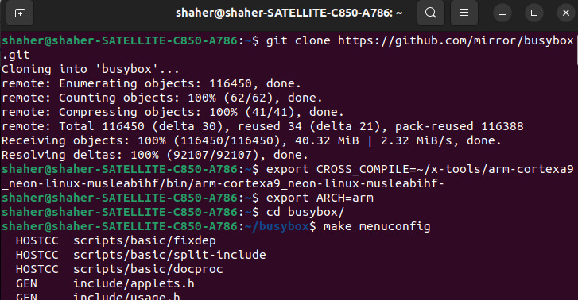
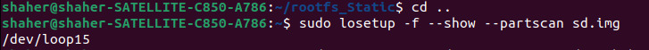

1. ### Clone busybox repo., setting the compiler and the architecture to arm, open menuconfig, and check the (build static binary) option inside settings, finally exit with saving.

   

2. ### Run the make command.

   

3. ### As you notice, busybox is statically linked. also notice that all files in (_install) their owner and  group are "shaher", We need to change them to "root" so that the root of the target be able to handle this file system.

   

4. ### Run "make install" command to create (_install) directory, inside which there are bin, sbin, usr directories.

   

5. ### Create a directory called "rootfs_Static" inside which We will but our file system with static commands, then copy or synch the directories in "_install" and its content inside rootfs_Static directory.

   

6. ### After copying the static commands created by the help of busybox, now we will assign the dynamic kernel modules. After that we will create the rest of the rootfs directories. We will also create to files, one under etc/init.d/ called rcS, this is a script file that will run in the initialization, and the seconf file called "inittab" will created under etc/, and this iss a configuration file which runs the rcS file, open the shell through the window/console the user entered or chose, and some other configs. For the rcS file make sure that it will be an executable file

   

7. ### We have to change the ownership and the group to "root" to make the root of the target able to handle his rootfs that will be passed to him.

   

   

8. ### Attach the sd card, because in its FAT (boot) partition We will put the zImage and the dtb file, and inside the ext4 (rootfs) partition We will copy the content of the rootfs_Static directory in it.

   

   

   

9. ### Now as everything is ready with us on the SD card, let's run qemu and emulate our target connecting to it our SD card "sd.img" and booting through the configured bootloader "u-boot".

   

10. ### Setting the bootargs variable such that the console will be ttyAMA0, putting the path of the rootfs, and the type of it (ext4).

    ### rootwait is written for safety purposes, cause if the loading of the rootfs will take much time the init process should wait before running till the loading of the rootfs is done.

    ### init file I understood that its a return point in case of a reset action happen or an action that should be terminated occured and there is a need to a point that the system restart from it.

    

11. ### Setting the zImage address and dtb file address in the target's RAM.

    

12. ### Load the zImage from the SD card (FAT partition) to the RAM in the specified addresses, and make sure that it is loaded.

    

13. ### Load the dtb file form the SD card (FAT partition) to its address in the RAM, and then make sure that it is loaded.

    

14. ### Boot the kernel (zImage) and the dtb file ...

    

15. ### I hope that this is what should We reach after all what We have done.

    

16. ### Finally, checking that the commands runs perfectly :).

    

#### For the dynamic commands, all the difference that we load the needed libraries in the sysroot. And this is DONE and tested that it is working.